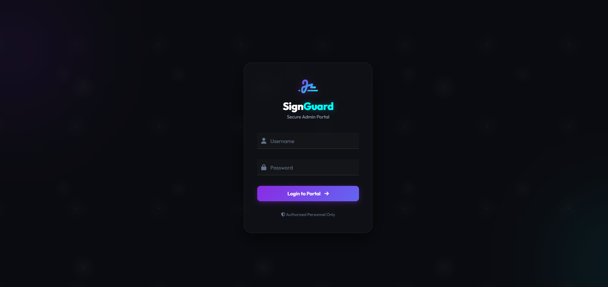
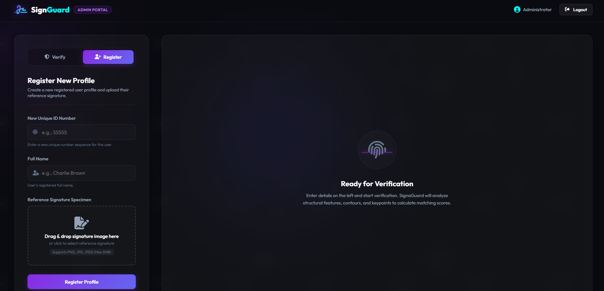
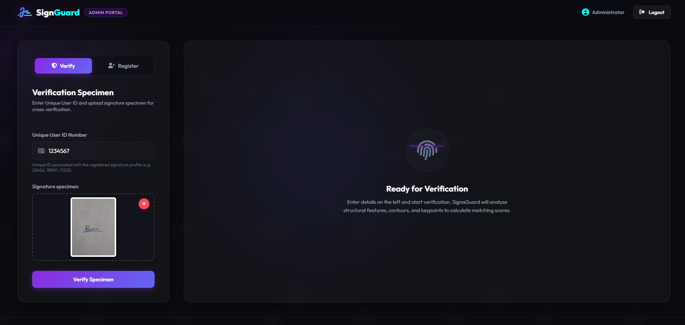
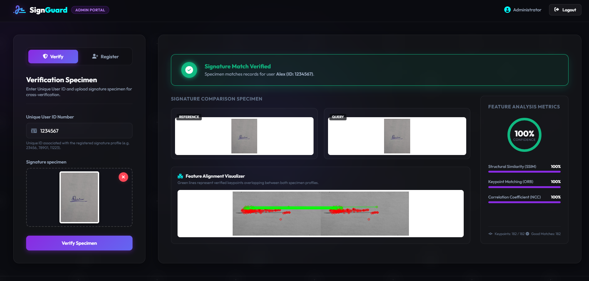
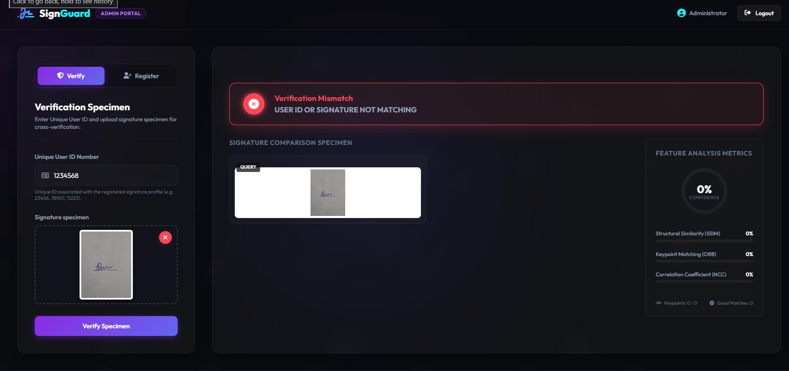

✍️ Signature Verification System

An **AI-based Signature Verification System** developed using Python and Flask to verify whether an uploaded signature matches a registered reference signature.

The system uses **image preprocessing and multiple image-comparison techniques** — SSIM, NCC, and ORB Feature Matching — to calculate a combined similarity score and determine whether the signature is genuine or not.

📌 Overview

Signature verification is an important application in areas such as banking, document authentication, identity verification, and digital security.

This project provides a simple web-based system where users can:

* Register a signature with a unique ID
* Upload a signature for verification
* Compare the uploaded signature with the registered signature
* Calculate a similarity score
* Display the verification result

The system combines multiple image-processing techniques to improve the reliability of signature comparison.

✨ Features

* 🔐 Unique ID-based signature verification
* 📝 Signature registration
* 🖼️ Image preprocessing
* 🔍 Signature similarity analysis
* 📊 Combined similarity score
* ✅ Genuine signature detection
* ❌ Mismatched signature detection
* 🌐 Web-based interface using Flask
* 📁 CSV-based signature database
* ⚡ Fast image comparison

---

🛠️ Technologies Used

### Frontend

* HTML
* CSS3
* Bootstrap
* JavaScript

### Backend

* Python
* Flask

### Libraries

* OpenCV
* NumPy
* Pandas
* Pillow

### Database

* CSV File

### Image Processing Techniques

* Grayscale Conversion
* Gaussian Blur
* Otsu Thresholding
* Image Cropping
* Image Resizing

### Signature Matching Algorithms

* Structural Similarity Index (SSIM)
* Normalized Cross-Correlation (NCC)
* ORB Feature Matching

---

🧠 Algorithms Used

 1. Structural Similarity Index (SSIM)

SSIM measures the structural similarity between two signature images.

It considers:

* Luminance
* Contrast
* Structural information

A higher SSIM value indicates that the two signatures are more structurally similar.

---

2. Normalized Cross-Correlation (NCC)

NCC compares the similarity between image patterns.

It is useful for determining how closely the uploaded signature matches the reference signature in terms of image intensity patterns.

---

 3. ORB Feature Matching

ORB (**Oriented FAST and Rotated BRIEF**) detects important features in signature images and compares those features between the reference and uploaded signatures.

It helps identify similarities even when there are small variations in the signature image.

⚙️ Verification Process

                 ┌───────────────────┐
                 │ Upload Signature  │
                 └─────────┬─────────┘
                           │
                           ▼
                 ┌───────────────────┐
                 │ Image Preprocessing│
                 └─────────┬─────────┘
                           │
                           ▼
              ┌──────────────────────────┐
              │ Compare with Reference  │
              └────────────┬─────────────┘
                           │
             ┌─────────────┼─────────────┐
             ▼             ▼             ▼
          ┌──────┐      ┌──────┐      ┌──────┐
          │ SSIM │      │ NCC  │      │ ORB  │
          └───┬──┘      └───┬──┘      └───┬──┘
              │             │             │
              └─────────────┼─────────────┘
                            ▼
                   ┌────────────────┐
                   │ Combined Score │
                   └───────┬────────┘
                           │
                           ▼
                  ┌──────────────────┐
                  │ Verification     │
                  │ Result           │
                  └──────────────────┘

📊 Similarity Score

The system combines the results of the three matching techniques using weighted scoring:

| Algorithm            | Weight |
| -------------------- | -----: |
| SSIM                 |    40% |
| NCC                  |    30% |
| ORB Feature Matching |    30% |

The final similarity score is calculated from these three components.

The system uses a **70% similarity threshold** to determine whether a signature is considered a match.

---

📁 Project Structure

text
signature-verification-system/
│
├── app.py
├── generate_dataset.py
├── signature_matcher.py
├── requirements.txt
├── .gitignore
│
├── database/
│   ├── signatures.csv
│   └── signatures/
│       └── *.png
│
├── static/
│   ├── css/
│   │   └── style.css
│   └── js/
│       └── main.js
│
├── templates/
│   ├── login.html
│   └── dashboard.html
│
└── test_signatures/
    ├── *_correct.png
    └── *_wrong.png

 🚀 Installation

 1. Clone the repository

git clone https://github.com/Deekshith-devx/signature-verification-system.git

 2. Navigate to the project

cd signature-verification-system

 3. Create a virtual environment

Windows:

python -m venv venv

 4. Activate the virtual environment

Windows PowerShell:

venv\Scripts\Activate.ps1

Windows Command Prompt:

venv\Scripts\activate

 5. Install dependencies

pip install -r requirements.txt

 ▶️ Run the Application

Start the Flask application:

python app.py

The application will start on the local Flask server.

Open the URL displayed in the terminal in your web browser.

---

📝 How to Use

Registration

1. Open the application.
2. Navigate to the registration section.
3. Enter a unique ID.
4. Enter the required user information.
5. Upload the user's signature.
6. Register the signature.

Verification

1. Enter the registered unique ID.
2. Upload a signature.
3. Submit the verification request.
4. The system preprocesses the images.
5. SSIM, NCC, and ORB matching are performed.
6. A combined similarity score is calculated.
7. The system displays the verification result.

---

 📷 Screenshots

### Login Page

### Registration Page

### Verification Page

### Successful Result

### Failed Result

## 🔮 Future Enhancements

* Replace CSV storage with MySQL or PostgreSQL
* Add a deep-learning-based signature verification model
* Improve performance on handwritten signatures
* Add user authentication and role-based access
* Add cloud deployment
* Add a larger real-world signature dataset
* Improve protection against forged signatures
* Add detailed verification reports
* Develop a mobile application

---

## 🎯 Applications

The system can be useful for:

* 🏦 Banking and financial applications
* 📄 Document authentication
* 🏢 Office and organizational verification
* 🎓 Educational institutions
* 🔐 Identity verification
* 📝 Digital document processing

 ⚠️ Disclaimer

This project is developed for **educational and demonstration purposes**. It should not be considered a production-grade biometric authentication system without additional security, testing, and validation using a large real-world dataset.

👨‍💻 Author

Deekshith

MCA Student | Python Developer | Web Development | AI/ML Enthusiast

GitHub: [@Deekshith-devx](https://github.com/Deekshith-devx)

⭐ Support

If you find this project useful, consider giving it a **⭐ Star** on GitHub.

## 📄 License

This project can be licensed under the **MIT License** if you want to make it freely reusable.
